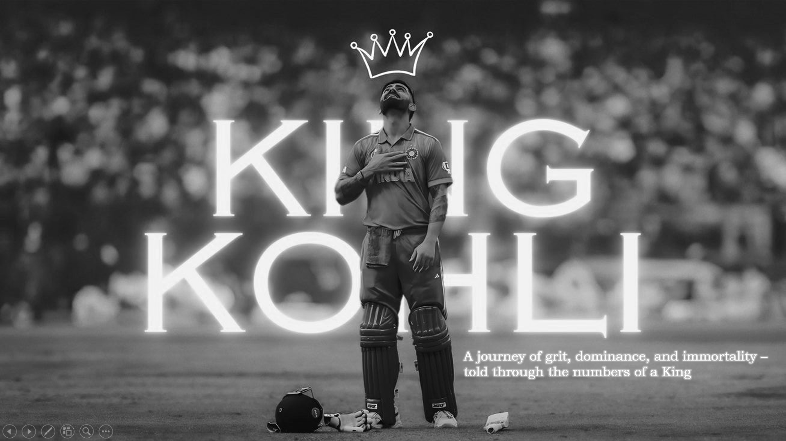

# 📊 Power BI Dashboard – Virat Kohli's Cricketing Journey  

This repository houses an interactive **Power BI Dashboard** (`.pbix` file) that dives deep into the cricketing saga of **Virat Kohli**, the modern-day maestro of Indian cricket and one of the greatest athletes of our era.  

The dashboard does more than just present numbers — it **transforms raw data into powerful visual stories**.  
Every chart, and every trend line reflects a chapter in Kohli’s journey:  
- the fearlessness of his early years,  
- the dominance of his peak run-chasing days,  
- the evolution of his strike rates across formats,  
- and the legacy he continues to build with every innings.  

With **runs, strike rates, tournament performances, and era-wise dominance** visualized in a clean and interactive format, this project captures the **heartbeat of a cricketer who redefined Indian cricket**.  

It’s more than analytics.  
It’s a **fusion of data and emotion** — a statistical tribute that lets fans and analysts relive Virat’s milestones, witness his consistency, and appreciate the sheer passion that has made him **King Kohli**.  

In short, this project is not just about dashboards.  
It’s about **grit, resilience, and legacy told through data storytelling** — the perfect blend of cricket and analytics.  

---

## 🏏 About Virat Kohli  

Virat Kohli is not just a batsman; he is **the heartbeat of a generation**.  
Born on **5th November 1988** in Delhi, he grew from a passionate street cricketer into one of the greatest athletes the sport has ever witnessed.  
His journey is a story of **discipline, determination, and destiny**.  

From leading India to victory at the **2008 U-19 World Cup**, to becoming the face of Indian cricket, Kohli has carried the expectations of over a billion fans with unmatched courage.  

- 🏆 **World Cup Winner (2011)** – Played a crucial role in India’s historic triumph.  
- 👑 **Chase Master** – Known for his ice-cold temperament in run-chases, rewriting how pressure situations are handled.  
- 💪 **Fitness Icon** – Revolutionized Indian cricket’s approach to fitness, turning the team into one of the fittest in the world.  
- 🐐 **Modern-Day Great** – With **80+ international centuries** and countless records, his name is etched among cricket’s immortals.  
- 🎖️ **Former Captain** – Led India across formats, instilling aggression, belief, and an unrelenting will to win. Under his leadership, Team India rose from 7th in Test rankings to 1st, showcasing his strategic brilliance and ability to inspire a team to reach the pinnacle.
 
He is an emotion that unites fans, a symbol of relentless hard work, and an inspiration to millions who believe that **dreams, when chased with passion, become destiny**.  

This dashboard is my way of honoring that journey — **letting data narrate the story of a legend, one run at a time**.  

---

## ✨ Dashboard Insights

The Power BI dashboard explores Virat Kohli’s cricketing journey, turning numbers into milestones, emotions, and evolution.

📈 **Runs vs Teams**
Highlights Virat’s consistency against all opponents. From Australia to Pakistan, the numbers show why he’s the “Run Machine”, thriving in pressure situations.

🎯 **Average & Strike Rate**
Shows his balance of aggression and consistency across formats — the calm chaser in ODIs, aggressive striker in T20s, and technically sound batsman in Tests.

🏆 **Tournament Analysis**
Captures heroics in ICC tournaments and high-pressure series, reflecting moments where he carried the team and turned games around.

⏳ **Era-wise Evolution**
Tracks his growth from fearless youngster to master chaser to seasoned leader, highlighting grit, adaptability, and longevity.

🙏 **Thank You Page**
A tribute beyond numbers — celebrating the fire, passion, and spirit of Virat Kohli, inspiring millions beyond the stats.

---

## 📸 Dashboard Views  

| Cover Page | ERA | Average Strike Rate |
|------------|-----|-------------------|
|  |  |  |

| Runs vs Teams | Tournament Analysis | Thank You Page |
|---------------|-------------------|----------------|
|  |  |  |

---

## 🛠️ Tools & Technologies  
- **Microsoft Power BI Desktop** – For building the interactive dashboard  
- **Power Query** – For cleaning and shaping raw data  
- **DAX (Data Analysis Expressions)** – For creating KPIs and custom measures  
- **Data Visualization Principles** – For storytelling with clarity and impact  

---

## 💡 Why This Project?  
Cricket is not just a sport in India; it’s an **emotion**.  
And Virat Kohli is its **loudest heartbeat**.  

This project is more than just charts — it’s an attempt to combine **the precision of data with the passion of cricket**.  
By exploring his statistics visually, we don’t just see runs and averages — we witness **the journey of a man who never gave up, who turned pressure into performance, and who carried a billion dreams on his shoulders**.  

---

## ✨ Author  
**Yash Havalannache**  
📧 yashhavalanache@gmail.com 
🔗https://www.linkedin.com/in/yashhavalannache 

---

⭐ *If this project inspires you, don’t forget to star this repo — because legends like Virat Kohli remind us that greatness is built one run at a time.*  

 ✨ Maintained by <a href="https://github.com/yashhavalannache">Yash Havalannache</a> ✨ 
 