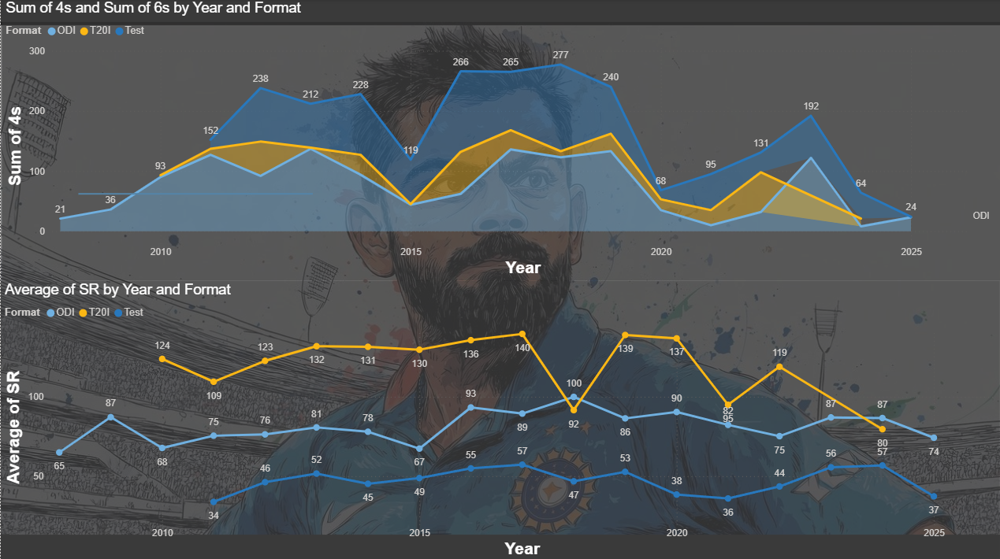
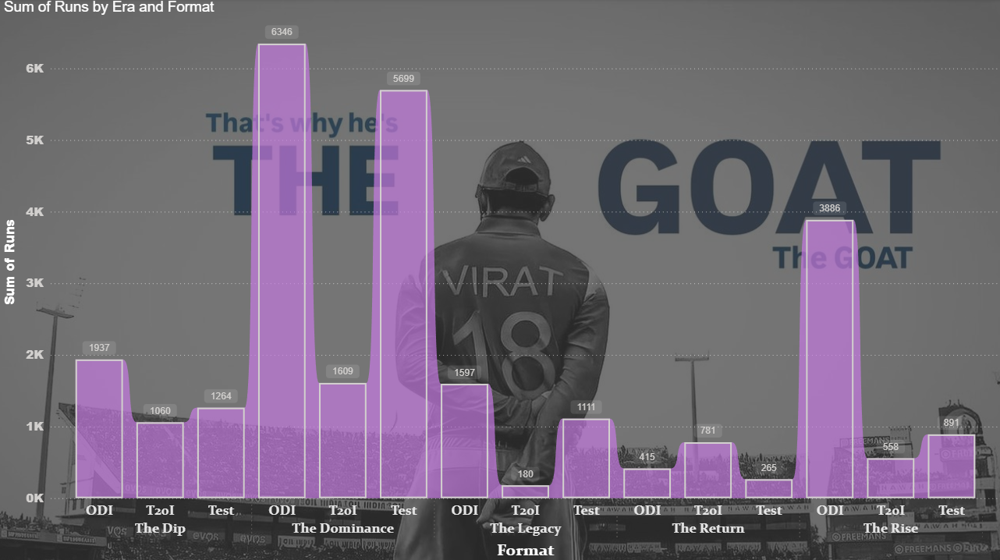
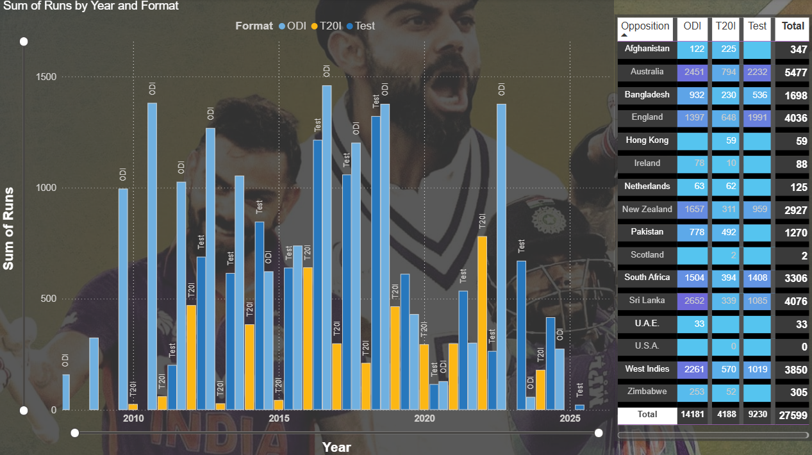
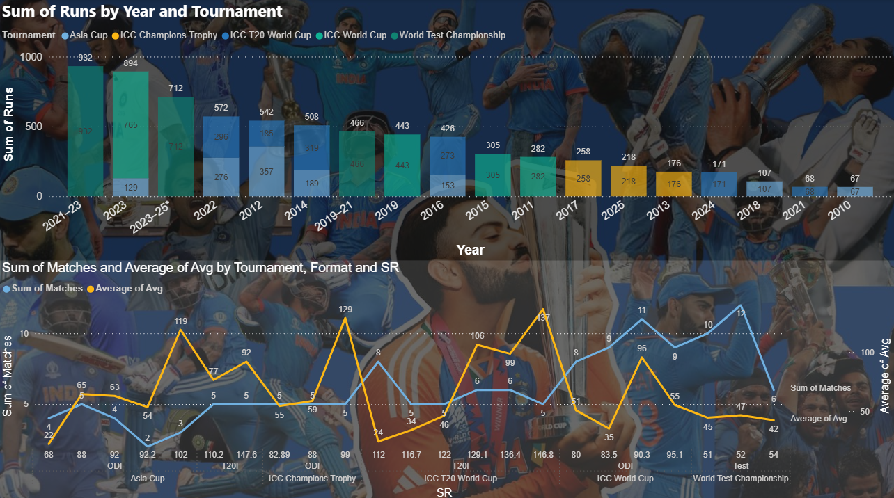

# 📊 Power BI Dashboard – [Your Project Name]

This repository contains an interactive **Power BI Dashboard** (`.pbix` file) that provides data-driven insights and visual storytelling.  
The dashboard is designed to make complex data easy to understand through clean visuals, KPIs, and analytics.  

---
## 🖼️ Dashboard Preview

## 📸 Dashboard Views

| Average Strike Rate | ERA | Runs vs Teams |
|---------------------|-----|---------------|
|  |  |  |

| Tournament Analysis | Thank You Page |
|---------------------|----------------|
|  |  |

---

## 🚀 Features
- Interactive visualizations and reports  
- Drill-down analysis for deeper insights  
- Custom KPIs and measures for business tracking  
- Intuitive layout with user-friendly design  

---

## 🛠️ Tools & Technologies
Power BI Desktop
Data Modeling (DAX, Power Query)
Visual Analytics & Dashboarding