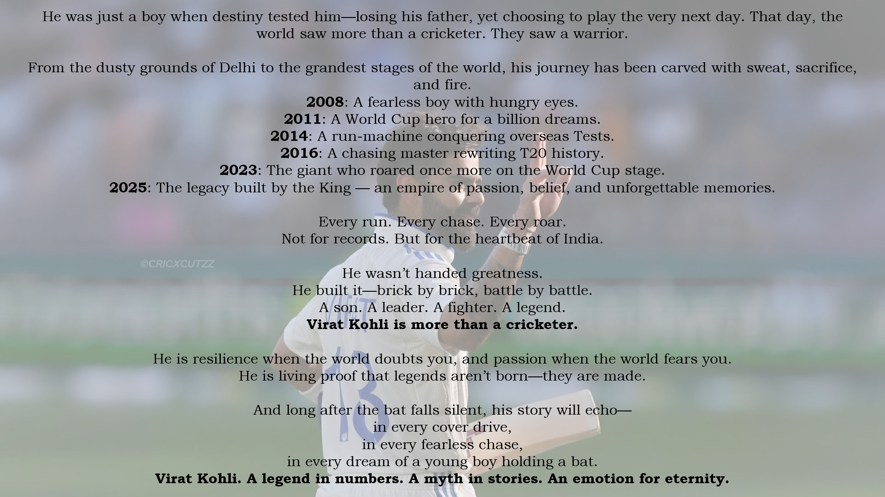

# 📊 Power BI Dashboard – Virat Kohli Cricketing Journey  

This repository contains an interactive **Power BI Dashboard** (`.pbix` file) dedicated to the cricketing journey of **Virat Kohli**, the modern-day maestro of Indian cricket.  
The dashboard transforms raw numbers into **visual stories** — bringing alive his runs, strike rates, tournament heroics, and era-wise evolution.  

It’s more than analytics.  
It’s **the story of grit, passion, and legacy told through data**.  

---

## 🏏 About Virat Kohli  
Virat Kohli is not just a batsman; he is **the heartbeat of a generation**.  
From the dusty streets of Delhi to the grandest stages of world cricket, he has carried the hopes of millions.  
- 🏆 **World Cup Winner (2011)**  
- 👑 **Chase Master** with an unmatched record in run-chases  
- 💪 **Fitness Icon** who redefined professionalism in Indian cricket  
- 🐐 **One of the greatest of all time**, with 70+ international centuries  

Every cover drive is poetry.  
Every innings is a masterclass in self-belief.  
And every statistic is proof of why he is called **King Kohli**.  

This dashboard is my way of honoring that journey — **letting data narrate the story of a legend**.  

---

## ✨ Dashboard Insights  
The Power BI dashboard covers multiple dimensions of Kohli’s cricketing life:  

- 📈 **Runs vs Teams** – Shows Virat’s consistency and dominance across different opponents.  
- 🎯 **Average & Strike Rate** – How his efficiency has evolved across formats and conditions.  
- 🏆 **Tournament Analysis** – Highlights his performances in high-stakes tournaments, where legends are truly made.  
- ⏳ **Era-wise Evolution** – Visualizing how Virat adapted his game with time — from the fearless youngster to the composed finisher.  
- 🙏 **Thank You Page** – A tribute slide, because numbers alone cannot capture his impact on fans’ hearts.  

---

## 📸 Dashboard Views  

| Average Strike Rate | ERA | Runs vs Teams |
|---------------------|-----|---------------|
|  |  |  |

| Tournament Analysis | Thank You Page |
|---------------------|----------------|
|  |  |

---

---

## 🛠️ Tools & Technologies  
- **Microsoft Power BI Desktop** – For building the interactive dashboard  
- **Power Query** – For cleaning and shaping raw data  
- **DAX (Data Analysis Expressions)** – For creating KPIs and custom measures  
- **Data Visualization Principles** – For storytelling with clarity and impact  

---

## 💡 Why This Project?  
Cricket is not just a sport in India; it’s an **emotion**.  
And Virat Kohli is its **loudest heartbeat**.  

This project is more than just charts — it’s an attempt to combine **the precision of data with the passion of cricket**.  
By exploring his statistics visually, we don’t just see runs and averages — we witness **the journey of a man who never gave up, who turned pressure into performance, and who carried a billion dreams on his shoulders**.  

---

## ✨ Author  
**Yash Havalannache**  
📧 yashhavalanache@gmail.com 
🔗https://www.linkedin.com/in/yashhavalannache 

---

⭐ *If this project inspires you, don’t forget to star this repo — because legends like Virat Kohli remind us that greatness is built one run at a time.*  

 ✨ Maintained by <a href="https://github.com/yashhavalannache">Yash Havalannache</a> ✨ 
 